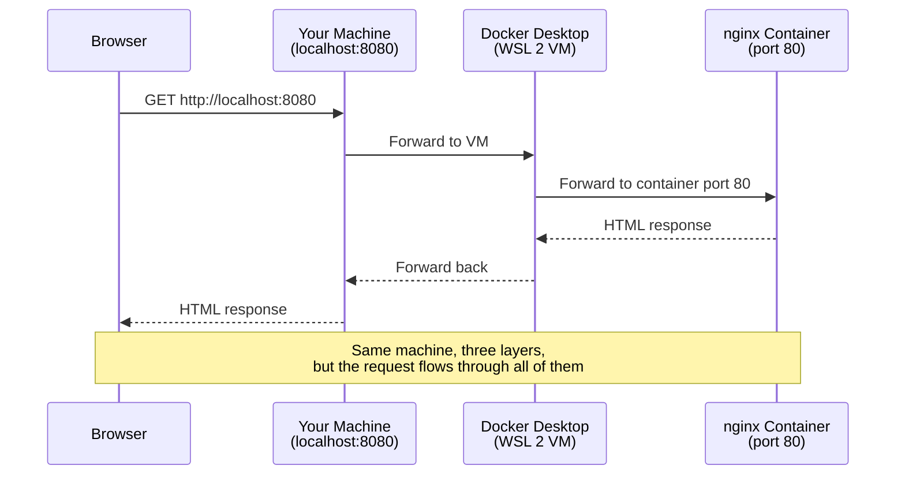
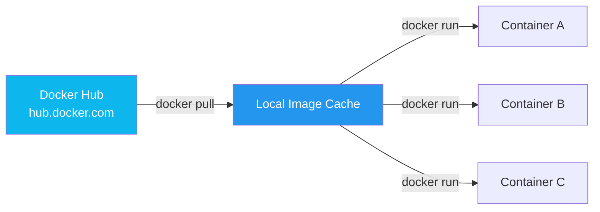

# Docker Desktop Beginner's Guide: Install, Tour the Dashboard, and Run Your First Container

You've heard the buzz. Someone on your team said *"just run it in Docker"* and nodded wisely. You installed the orange whale icon. Then you stared at a dashboard with five tabs and a terminal prompt that just blinks at you.

This guide is for you.

By the end of these 15 minutes, you'll have Docker Desktop installed, you'll know what every tab on the dashboard actually does, and you'll have a real web server running in a container — accessed from your own browser. No Linux background required.

This is **Article 1 of the *Docker Zero to Production* series**. Future articles will cover Docker Hub, writing production-grade `docker-compose.yml` files, and splitting them cleanly across dev, staging, and production.

---

## The "Works on My Machine" Problem

Every team has lived this moment. Code passes all tests locally. CI goes red. Production explodes. The bug report is always the same: *"Works on my machine."*

The root cause is almost never the code. It's the **environment** — the specific combination of OS, library versions, system tools, network configuration, and accumulated cruft that lives on a developer's laptop. That environment is impossible to reproduce exactly on someone else's laptop, in CI, or on a production server.

Containers fix this by packaging the application **and** its environment into a single artifact. That artifact runs identically on your Mac, your teammate's Windows laptop, the CI runner, and the production server. The artifact is the environment.

> **Key insight:** A container isn't a tiny virtual machine. It's just a process with a private filesystem and a constrained view of the host. That distinction is what makes containers fast, cheap, and easy to ship.

Before we install anything, let's clear up the most common confusion beginners hit.

### Image vs Container

You'll hear both words constantly. Here's the cleanest analogy:

| Concept | Analogy | Description |
|---------|---------|-------------|
| **Image** | A class / a recipe | A read-only blueprint. The filesystem, the code, the dependencies — all baked in. |
| **Container** | An instance / a cake | A running copy of an image. You can start one, ten, or a hundred containers from the same image. |

An image is a file. A container is a running process started from that file. You can't edit a running container and have those changes stick — once you remove it, everything inside is gone (unless you used a volume, which we'll cover in a later article).


### Containers vs Virtual Machines

If you've used VirtualBox or VMware, you might wonder why you'd use a container instead. The difference is the layer of abstraction:


The VM stack runs a full guest OS inside your host OS. The container stack shares the host's kernel — there's no guest OS. That's why containers start in milliseconds and VMs take minutes, and why a 1 GB container image often does what a 20 GB VM image does.

---

## Why Docker Desktop Exists

Here's a detail that confuses people: **on Linux, Docker runs natively.** On macOS and Windows, the kernel doesn't support Linux containers out of the box, so you need a small Linux VM under the hood.

Docker Desktop is that VM, plus a nice GUI, plus extras like Docker Compose, Docker Scout, and Extensions. When you click that whale icon in your menu bar, you're not just starting the Docker daemon — you're spinning up a managed Linux VM that runs the actual containers, and the dashboard gives you a window into that VM.


> **Key insight:** On Windows, Docker Desktop uses WSL 2 by default. On macOS on Apple Silicon, it uses Apple's native virtualization framework. You rarely need to think about the VM — but knowing it's there explains why Docker Desktop needs several GB of RAM.

---

## Installing Docker Desktop

### On macOS

1. Go to [docker.com/products/docker-desktop](https://www.docker.com/products/docker-desktop/) and download the **Mac with Apple Silicon** or **Mac with Intel** installer (check "About This Mac" if you're unsure).
2. Drag **Docker.app** into **Applications**.
3. Launch it. The whale icon appears in your menu bar.
4. Click the icon → **Sign in / Create a Docker Hub account** (you'll need this to push images later — pulling is free without an account).
5. The dashboard opens. Docker is ready.

### On Windows

1. Download the **Docker Desktop for Windows** installer from the same page.
2. Run the installer. It enables WSL 2 and Hyper-V as needed. **Restart when prompted.**
3. After restart, launch Docker Desktop. The whale icon appears in the system tray.
4. Sign in or create a Docker Hub account.
5. The dashboard opens. Docker is ready.

> **Key insight:** On Windows, Docker Desktop's default backend is **WSL 2** (Windows Subsystem for Linux). If you ever see cryptic errors about virtualization, open **Settings → General** and check that *"Use the WSL 2 based engine"* is enabled. You'll also need WSL installed — Docker Desktop offers to install it for you.

**Verify the install** by opening a terminal and running:

```bash
docker --version
docker compose version
docker run hello-world
```

The `hello-world` command is a sanity check built into Docker itself. It pulls a tiny image from Docker Hub, runs it, prints a message explaining what just happened, and exits. If you see a multi-paragraph welcome message, your install is good.

---

## The Dashboard Tour

Click the whale icon and choose **Dashboard**. You'll see five tabs in the left sidebar. Here's what each one is for:

| Tab | What it shows | When you use it |
|-----|---------------|-----------------|
| **Containers** | All running and stopped containers on this machine | Day-to-day: start, stop, inspect, open a shell, view logs |
| **Images** | All images pulled or built locally | Cleanup unused images, inspect image layers, see size |
| **Volumes** | Named persistent storage attached to containers | Inspect data that survives container removal |
| **Dev Environments** | Cloud-hosted dev environments (powered by Gitpod under the hood) | Throwaway cloud IDEs for onboarding or reproductions |
| **Extensions** | Marketplace of third-party tools that integrate with Docker Desktop | Add vulnerability scanners, DB GUIs, log viewers, etc. |
| **Models** *(Docker AI)* | Experimental LLM-powered assistant for Docker tasks | Ask natural-language questions about your setup |

For 90% of your day, you'll live in **Containers** and **Images**. The dashboard is genuinely useful for newcomers because it visualizes what would otherwise be abstract CLI output. But you'll quickly outgrow it for serious work — the terminal is faster.

---

## Your First Real Container: Nginx

Let's run something more interesting than `hello-world`. We'll run **nginx** — a real, production-grade web server — in a container, and access it from your browser.

```bash
docker run -d -p 8080:80 --name my-nginx nginx
```

Let's break down every flag:

- `docker run` — create and start a new container.
- `-d` — "detached" mode. Run in the background; don't block the terminal.
- `-p 8080:80` — **port mapping**. Map port `8080` on your host to port `80` inside the container. Nginx listens on 80 internally; we want to reach it from our host on 8080.
- `--name my-nginx` — give the container a human-readable name. Without this, Docker generates a random adjective-noun pair.
- `nginx` — the image to use. Docker will pull it from Docker Hub if you don't have it locally.

Open your browser to **http://localhost:8080**. You should see the nginx welcome page. You just ran a web server in a container, served by a process running inside a Linux VM, all without installing nginx on your actual machine.



### Managing the container

Now that nginx is running, here are the commands you'll use most:

```bash
docker ps            # List running containers
docker ps -a         # List all containers (including stopped)
docker logs my-nginx # View container logs (Ctrl+C to exit)
docker stop my-nginx # Stop a running container
docker start my-nginx # Start a stopped container
docker rm my-nginx   # Remove a stopped container
docker rm -f my-nginx # Force-remove a running container
```

The dashboard does the same things with clicks. Use whichever feels faster.

> **Key insight:** `docker stop` sends a `SIGTERM` to the main process, giving it a few seconds to clean up. `docker kill` sends `SIGKILL` immediately. Always prefer `stop` — it lets the process flush buffers, close connections, and write checkpoints.

---

## Pulling Images from Docker Hub

You just typed `nginx` and Docker magically produced a running web server. Where did it come from?

**Docker Hub** — `hub.docker.com` — is the default public registry. Think of it as GitHub, but for container images. When you reference `nginx` (or `python`, `node`, `postgres`, `redis`), Docker pulls the image from Docker Hub if it doesn't already exist locally.

```bash
docker pull node:22
docker images
```

`node:22` is `node` image, version 22. The tag (`22` in this case) is how you pin a specific version. Without a tag, Docker assumes `latest`, which is almost never what you want in real projects — `latest` is a moving target.

The tag system follows a simple pattern: `repository[:tag][@digest]`. Examples:

| Reference | Meaning |
|-----------|---------|
| `nginx` | The `nginx` repository, `latest` tag |
| `nginx:1.27` | The `nginx` repository, version `1.27` |
| `nginx:1.27-alpine` | Version 1.27, built on Alpine Linux (smaller image) |
| `nginx@sha256:abc...` | A specific image, pinned by content hash (most reproducible) |



You can run **multiple containers from the same image** — they each get their own isolated filesystem, ports, and lifecycle. To prove it:

```bash
docker run -d -p 8081:80 --name nginx-two nginx
docker run -d -p 8082:80 --name nginx-three nginx
```

You now have three independent nginx servers, all from the same image, all serving on different ports. Try `docker ps` — you'll see all three running.

---

## Where Does My Data Go?

Here's a gotcha that bites every beginner. Create a container, write a file inside it, delete the container, recreate it — **the file is gone.**

```bash
docker run -it --name temp ubuntu bash
# inside the container:
echo "hello" > /tmp/hi.txt
exit

docker rm temp
docker run -it --name temp2 ubuntu bash
cat /tmp/hi.txt
# cat: /tmp/hi.txt: No such file or directory
```

Containers are designed to be **ephemeral**. Their filesystem lives only as long as the container does. This is intentional — it's what makes containers reproducible. The right way to persist data is with **volumes**, which we'll cover in depth in a later article in this series. For now, remember the rule:

> **Key insight:** If a file matters, store it outside the container. Anything inside the container's filesystem is a candidate for being lost on the next `docker rm`.

---

## Five Beginner Mistakes to Avoid

These are the mistakes almost every Docker newcomer makes in their first week.

**1. Forgetting `-p`.** You start a container, point your browser at `localhost`, and get "connection refused." Nine times out of ten, you forgot the port mapping. The container is happily listening — just on a port you can't reach.

**2. Using `latest` everywhere.** It works today, breaks tomorrow. Always pin a tag. `node:22.11`, not `node`.

**3. Not naming containers.** You'll end up with five containers called `angry_pare` and `zen_easley`. Name them. Use a project prefix: `acme-api`, `acme-worker`, `acme-db`.

**4. Leaving stopped containers and dangling images everywhere.** Run `docker system df` to see how much disk Docker is using. Run `docker container prune` and `docker image prune` regularly.

**5. Treating the container as a long-lived server.** Containers are not pets. They are cattle. The whole point is that you can `docker rm` them and start a fresh one from the image at any time. If you're scared to delete a container, something important is in it that shouldn't be.

---

## What You Just Learned

Recap, in one minute:

- **Containers** package an app with its environment so it runs identically everywhere.
- **Images** are read-only blueprints. **Containers** are running processes started from images.
- **Docker Desktop** is the GUI + Linux VM that lets you run Linux containers on Windows and Mac.
- **`docker run -d -p 8080:80 --name my-nginx nginx`** spins up a real web server in seconds.
- **Docker Hub** is the public registry of images. Use tagged versions, never `latest`.
- **Container filesystems are ephemeral.** Use volumes for data that must survive container removal.

You now have the foundation to actually understand the rest of the Docker ecosystem — Compose, volumes, networks, multi-stage builds, registries.

---

## What's Next in This Series

Article 1 covered the *what* and the *why*. The next two articles go deeper:

- **Article 2 — Docker Hub for Beginners**: accounts, repositories, pushing your own images, private vs public, image tags and digests, automated builds.
- **Article 3 — `docker-compose.yml` for Dev, Staging, and Production**: the override pattern, environment-specific configuration, secrets, and how to keep one repository serving three environments without duplicating files.

If you've never written a `Dockerfile` or stared at a `docker-compose.yml` wondering why your service can't reach the database, Article 3 is where that pain ends.

---

## FAQ

**Do I need a Docker Hub account just to use Docker Desktop?**
No. Pulling public images works without an account. You need one only when you want to **push** your own images or use private repositories.

**Why is Docker Desktop using so much RAM?**
It's running a Linux VM in the background. The default allocation is 4–8 GB. You can lower it under **Settings → Resources → Memory**, though going below 2 GB tends to make things unstable.

**Can I run Docker Desktop on Windows Home?**
Yes. WSL 2 support was added to Windows Home years ago, and that's all Docker Desktop needs. The Pro-only Hyper-V backend is no longer required.

**What's the difference between `docker-compose` and `docker compose`?**
`docker compose` (with a space) is the v2 plugin that's bundled with Docker Desktop and is the current standard. The older `docker-compose` (with a hyphen) was a separate Python tool that's now deprecated. Always use the v2 form.

**Is Docker Desktop free?**
Docker Desktop is free for individuals and small businesses (under 250 employees / $10M revenue). Larger organizations need a paid subscription. The Docker Engine itself is always free.
