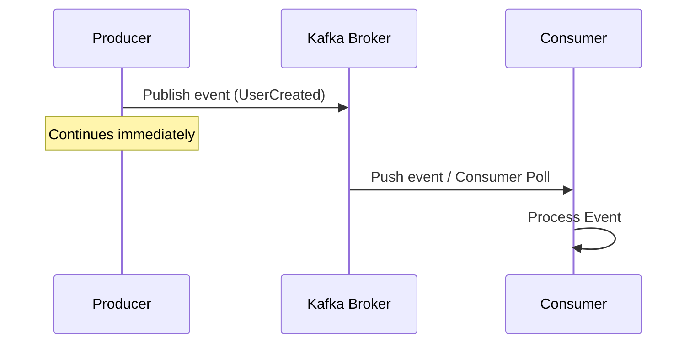

# Blog #1: Introduction to Event-Driven Testing

Welcome to the **Apache Kafka API Testing Series**! In this series, we will transition from traditional request-response (REST) testing to the world of asynchronous, event-driven testing.

## 1. Request-Response vs. Event-Driven

In a standard REST API, communication is **synchronous**:
* Client sends a request.
* Client blocks and waits.
* Server responds immediately with a status code.

In an **Event-Driven Architecture (EDA)**, communication is **asynchronous** and **decoupled**:
* Producer publishes an event (e.g., `UserCreated`).
* Producer immediately continues its work without waiting for a response.
* Consumers subscribe to the event stream and process messages at their own pace.

## 2. Why is Testing Asynchronous Systems Harder?

Testing synchronous REST APIs is straightforward: call the endpoint, assert the response. Event-driven testing introduces new challenges:
* **No Direct Response:** You cannot check a return value directly.
* **Timing & Eventual Consistency:** Events might take milliseconds or seconds to propagate.
* **State Management:** Tracking which events have been consumed and processed requires consumer group offsets.

Throughout this series, we will build a complete testing framework to tackle these challenges!
