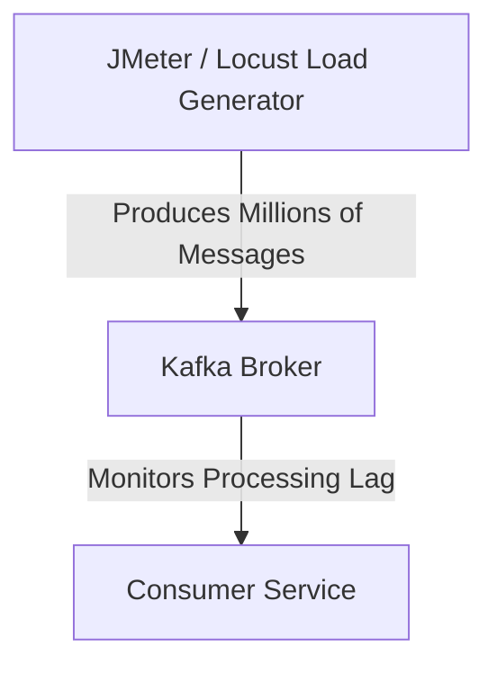

# Blog #14: Load Testing Kafka

How does your system react under peak traffic? We can write performance load scripts to push millions of messages into Kafka and monitor latency.

## 1. High-Throughput Load Testing

## 2. Key Metrics to Assert
* **Consumer Lag:** Is the consumer processing rate keeping up with the production rate?
* **Serialization Time:** How fast are payloads converted into byte arrays?
